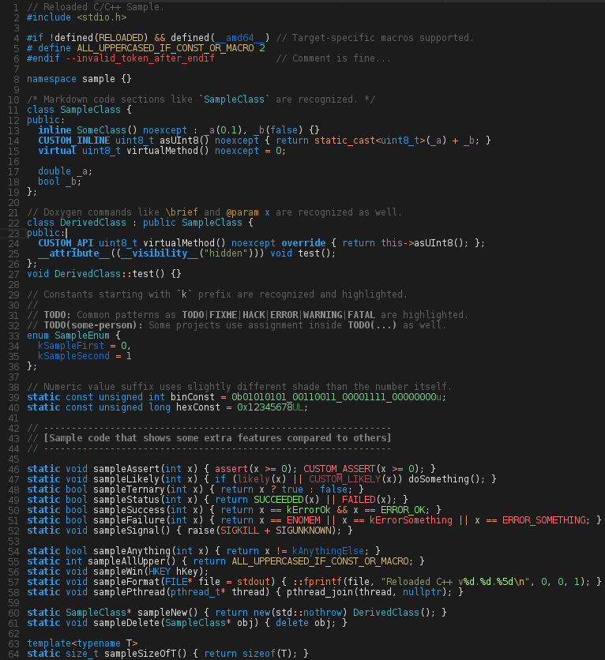
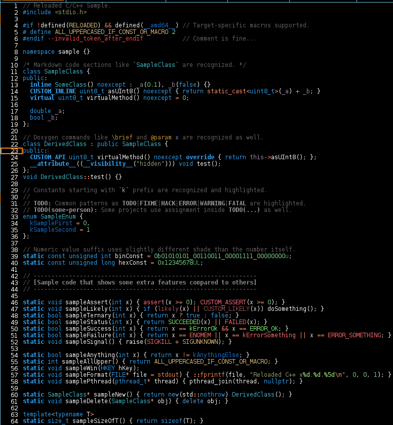
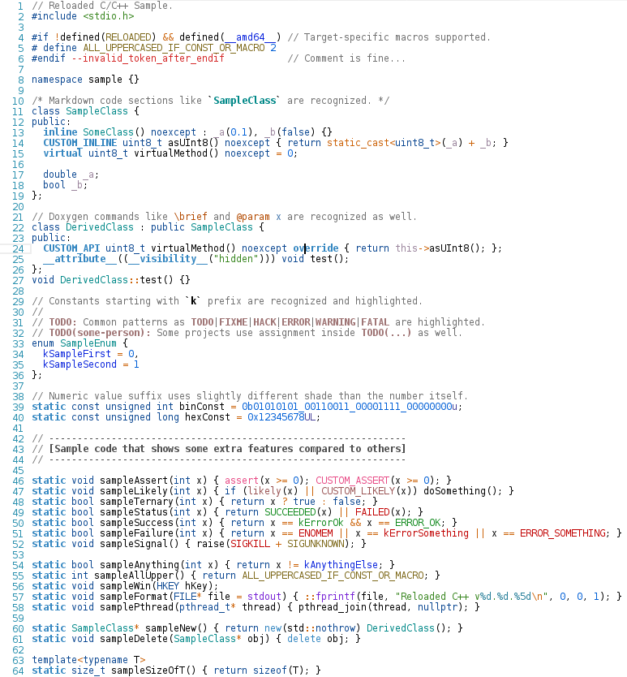

## Reloaded themes

A collection of themes designed to use extended styles provided by [Reloaded C/C++](https://marketplace.visualstudio.com/items?itemName=reloadedextensions.reloaded-cpp) extension. This theme package contains both dark and light themes. Dark theme has 2 variations and one "high-contrast" mode that uses high-contrast UI theme as provided by vscode.

# The following languages are tested and officially supported

  * C/C++
  * Javascript
  * HTML/XML
  * CSS

If you use Reloaded Themes package and use language that is not consistent with other themes (for example missing highlighting of some language constructs that are highlighted in others) please fill a bug so it can be fixed. Also, if you think that a language that is not listed is just fine, you can let the author know to include that language into the languages supported list.

# Reloaded Dark [Default]

# Reloaded Dark [High-Contrast]

# Reloaded Light [Default]

